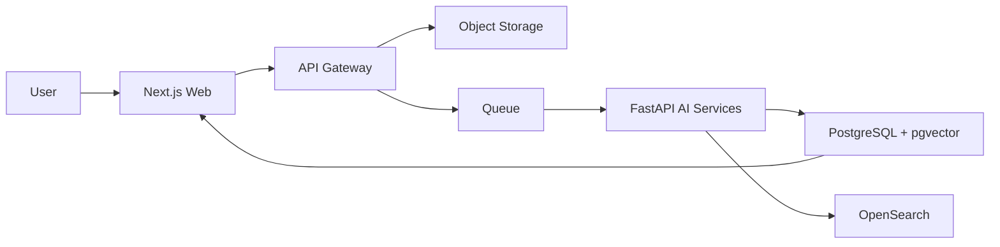

# Architecture

## Rationale

The platform is built as a monorepo so an early team can run everything locally while keeping clear boundaries for enterprise deployment.

## Runtime Components

- `apps/web`: Next.js dashboard and runnable local APIs.
- `apps/api`: API gateway boundary for NestJS modules, RBAC, OpenAPI, rate limiting, and tenant enforcement.
- `apps/ai-services`: FastAPI boundary for OCR, CV, classification, translation, and embeddings.
- `apps/worker`: queue worker boundary for asynchronous processing.
- `packages/shared-types`: shared contracts.
- `packages/sdk`: browser/server SDK for customer integrations.
- `database/migrations`: PostgreSQL, pgvector, and audit/billing schema.
- `infrastructure`: Docker, Kubernetes, and Terraform baselines.

## Processing Flow

## Trade-offs

- The local MVP uses JSON-backed storage and deterministic heuristics to stay under the early-stage cost target.
- Production swap points are isolated behind storage and pipeline modules.
- Real OCR/ML engines can replace the local simulators without changing the dashboard or API contracts.
